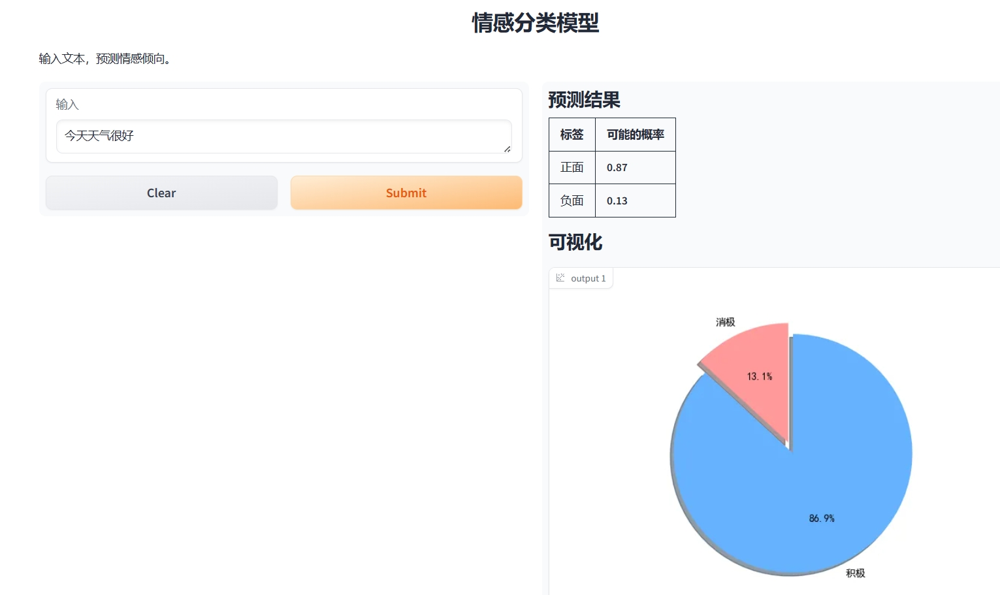
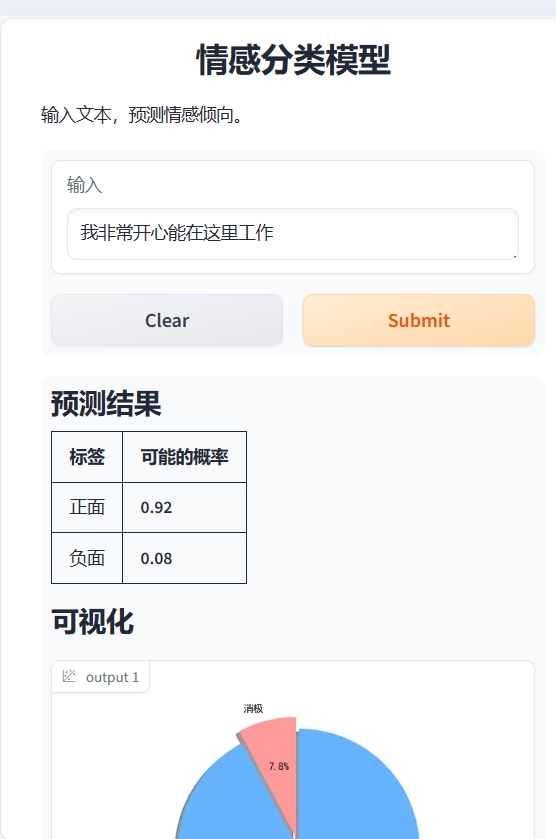

# 情感分类器

## 简介

使用gradio对模型[IDEA-CCNL/Erlangshen-Roberta-110M-Sentiment](https://huggingface.co/IDEA-CCNL/Erlangshen-Roberta-110M-Sentiment)
进行可视化部署。

## 全部程序

```python
# encoding: utf-8
'''
 @author :我不是大佬 
 @contact:2869210303@qq.com
 @wx     ;safeseaa
 @qq     ;2869210303
 @github ;https://github.com/U202142209
 @blog   ;https://blog.csdn.net/V123456789987654 
 @file   :main.py
 @time   :2024/7/2 23:10
  '''

import os

# 配置请求代理
os.environ["http_proxy"] = "http://127.0.0.1:7890"
os.environ["https_proxy"] = "http://127.0.0.1:7890"

import gradio as gr
import matplotlib.pyplot as plt
from transformers import BertForSequenceClassification, BertTokenizer
import torch

# 支持中文
plt.rcParams['font.family'] = 'SimHei'  # 替换为你选择的字体

# 初始化模型和分词器
tokenizer = BertTokenizer.from_pretrained('IDEA-CCNL/Erlangshen-Roberta-110M-Sentiment')
model = BertForSequenceClassification.from_pretrained('IDEA-CCNL/Erlangshen-Roberta-110M-Sentiment')


# 定义预测函数
def predict_sentiment(text):
    # 编码文本
    inputs = tokenizer.encode(text, return_tensors="pt")
    # 获取模型输出
    output = model(inputs)
    # 计算softmax概率
    probs = torch.nn.functional.softmax(output.logits, dim=-1)
    # 提取概率
    prob_class_0 = probs[0, 0].item()  # 消极
    prob_class_1 = probs[0, 1].item()  # 积极

    # 绘制饼形图
    labels = '消极', '积极'
    sizes = [prob_class_0, prob_class_1]
    colors = ['#ff9999', '#66b3ff']
    explode = (0, 0.1)  # 突出显示第二个片段（'积极'）

    fig1, ax1 = plt.subplots()
    ax1.pie(
        sizes, explode=explode,
        labels=labels, colors=colors, autopct='%1.1f%%',
        shadow=True, startangle=90)
    ax1.axis('equal')  # 确保饼图是圆的

    # 返回结果和饼形图
    return f"""
    ## 预测结果

    <div style="margin: 0 auto;   width: auto; ">

    | 标签 | 可能的概率 |
    |----|-------|
    | 正面 | **{prob_class_1:.2f}** |
    | 负面 | **{prob_class_0:.2f}** |

    </div>

    ## 可视化

    """, fig1
    # return f"预测结果，消极的概率为**{prob_class_0:.2f}**，积极的概率为**{prob_class_1:.2f}**", fig1


# 创建输入组件
input_textbox = gr.Textbox(label="输入", placeholder="请输入文本")

# 创建 Gradio 接口
iface = gr.Interface(
    fn=predict_sentiment,
    inputs=gr.Textbox(
        label="输入",
        placeholder="请输入文本",
        value="今天天气很好"
    ),
    outputs=[gr.Markdown(label="结果"), "plot"],
    title="情感分类模型",
    description="输入文本，预测情感倾向。",
    examples=[
        "今天天气很好",
        "这部电影真的很糟糕",
        "我非常开心能在这里工作",
        "虽然这个产品的外观精致，但是性能很差"
    ],
    article="这是一个基于预训练模型的情感分类模型，可以对文本进行情感倾向预测。模型来源:IDEA-CCNL/Erlangshen-Roberta-110M-Sentiment"
)

# 启动 Gradio 应用
iface.queue(default_concurrency_limit=3).launch()

```
请注意，加载模型有两种方式：
- 程序自动从网上下载，本程序就是使用这种方式，需要良好的网络环境
- 将模型下载到本地，直接从本地加载，此方式运行时无需联网，只需要指定模型所在的文件夹路径即可，具体请参考文档

## 如何使用
将代码clone到本地后，直接运行```main.py```即可。
```shell
python main.py
```
程序会监听```http://127.0.0.1:7861```,直接使用浏览器访问此链接即可
```text
Running on local URL:  http://127.0.0.1:7861

To create a public link, set `share=True` in `launch()`.
```

## 效果预览
支持屏幕自适应





## 参考文档

IDEA-CCNL/Erlangshen-Roberta-110M-Sentiment:https://huggingface.co/IDEA-CCNL/Erlangshen-Roberta-110M-Sentiment

gradio官网文档::https://www.gradio.app/docs

## 获取帮助
```text
 @author :我不是大佬 
 @contact:2869210303@qq.com
 @wx     ;safeseaa
 @qq     ;2869210303
 @github ;https://github.com/U202142209
 @blog   ;https://blog.csdn.net/V123456789987654 
```